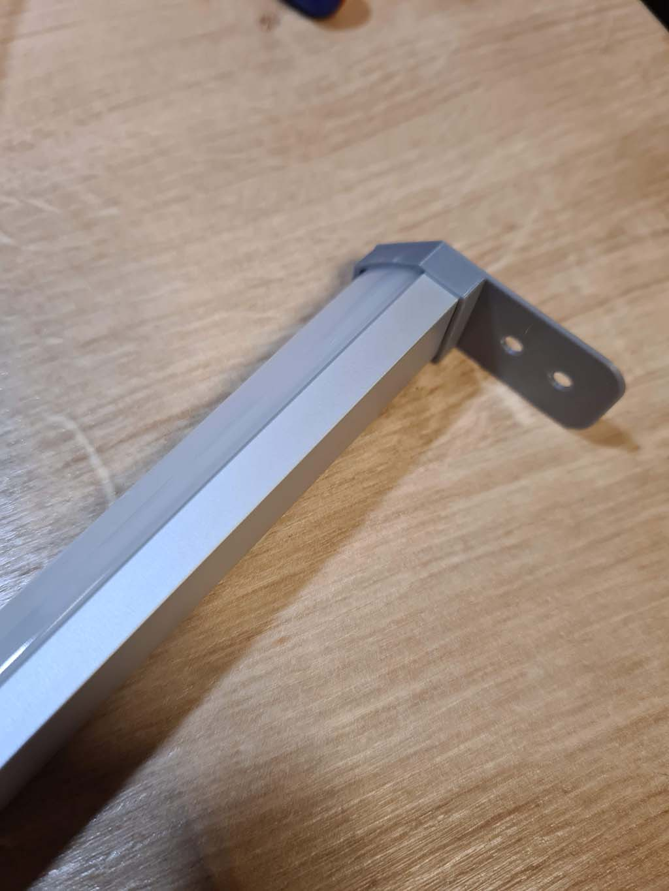

**BOM**
|Part NO.  |Qty  |
|--|--|
| LED Extrusion | 1 |
| TCRT5000L Reflective Optical Sensor | 1 |
| 10uF Capacitor | 2 |
| BS170FTA N-P-N Transistor | 1 |
| L4941BDT-TR Stepdown Converter | 1 |
| 90° XH Connector | 2 |
| 47K Resistor | 1 |
| 220 Resistor | 1 |

Buy some [Lumentec led extrusions](https://lumentec.eu/epages/e4360bea-6b9b-4161-a115-a88bb0233b45.sf/de_DE/?ObjectPath=/Shops/e4360bea-6b9b-4161-a115-a88bb0233b45/Products/5901874288943)

Order the PCBS at e.g. [JLCPCB](https://jlcpcb.com/) dont forget to add the stencil

Order the parts at e.g. [LCSC](https://www.lcsc.com/) you can upload the BOM to their [uploader](https://www.lcsc.com/bom) and select the "Supplier Part" from the bom as their "LCSC Part Number"

**Assembly**
- Print the mounts
- 
- Assemble the PCB
- Cut the Extrusions to your desired length
- Lay your led strips into the extrusions
- 
- Add some vhb to the end of the strip to avoid shorts and stick on your PCB
- 
- Cut the acrylics that your TCRT sticks out
- Be sure to add your power cable before you add the mounts, or to it like me and cutout the bridge
- 
- 
- Add the mounts to the extrusions, they fit very tight around the acrylic, i used some pliers to get around it
- 
- Mount the lightbars in your drawer, do a testfit as the sensing distance is not this far
- for me it was about 8mm from the drawer front
- 
- it looks so awesome